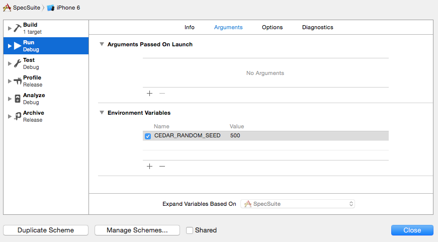

# Thrust

# 

[](https://travis-ci.org/pivotal/thrust)
[](http://nodejs.org/api/documentation.html#documentation_stability_index)
[](https://www.pivotaltracker.com/projects/987818) (contact avonderhaar@pivotal.io if you need access)

__Thrust__ is a small project that contains some useful rake tasks to run Cedar specs and build iOS app archives for deployment.
   
    rake autotag:create[environment]          # Create a tag for the given deployment environment
    rake autotag:list                         # Show the commit that is currently deployed to each environment
    rake build_ipa:demo                       # Build an .ipa file for deployment to demo
    rake build_ipa:production                 # Build an .ipa file for deployment to production
    rake build_ipa:staging                    # Build an .ipa file for deployment to staging
    rake clean                                # Clean all targets
    rake focused_specs                        # Print out names of files containing focused specs
    rake nof                                  # Remove any focus from specs
    rake set_build_number[build_number]       # Set build number
    rake spec_bundle[device_name,os_version]  # Run the FakeProject scheme
    rake spec_suite[device_name,os_version]   # Run the SpecSuite target
    rake mac_suite[device_name,os_version]    # Run the MacSpecSuite target
    rake trim                                 # Trim whitespace


# Installation

(Note: **Thrust** requires ruby >= 1.9.3)

**Thrust** should be installed as a gem.  It comes with an installer that will set up your Rakefile and create an example configuration file.

    gem install thrust
    thrust install

After installation, change the name of `thrust.example.yml` to `thrust.yml` and update the configuration as needed.

If you're using **Thrust** to run specs for an iOS app and do not have *ios-sim* installed, you can find it at https://github.com/phonegap/ios-sim or install it using homebrew:
    
    brew install ios-sim

If you had **Thrust** previously installed as a submodule, we recommend that you remove the submodule and now use **Thrust** as a gem.  This is because there are runtime dependencies that will not get installed properly if **Thrust** is installed as a submodule.

# Recent Changelog

See [CHANGELOG.md](https://github.com/pivotal/thrust/blob/master/CHANGELOG.md) for the full list of changes.

## Version 0.7.1 Changes

* Adds support for building schemes instead of targets when deploying

## Version 0.7 Changes

* Drops support for automated deploys to TestFlight, since testflightapp.com no longer exists.  We recommend that you use **Thrust** in conjunction with another gem that supports automated deploys, e.g. [shenzhen](https://github.com/nomad/shenzhen) or [deliver](https://github.com/KrauseFx/deliver).

* Adds rake tasks for building an .ipa file for deployment.  The rake tasks use the existing TestFlight deployment configurations to build the .ipa's.  The keys that are still used are:
	
    * `target`
    * `build_configuration`
    * `provisioning_search_query`
    * `versioning_method`
    * `tag`
    
## Version 0.6 Changes

* Drops Android support.  If you want to use **Thrust** to deploy Android apps to TestFlight, use version 0.5.2.

* Drops `ios` prefix from keys in `thrust.yml`:

    * `ios_spec_targets` => `spec_targets`
    * `ios_distribution_certificate` => `distribution_certificate`
    * `deployment_targets` > `ios_target` => `target`
    * `deployment_targets` > `ios_provisioning_search_query` => `provisioning_search_query`
    * `deployment_targets` > `ios_build_configuration` => `build_configuration`

* Adds `spec_directories` configuration key to `thrust.yml`.  This allows you to specify from where `rake nof` removes focused specs.

* Updates `spec_targets` to require the `scheme` name instead of the `target` name.  The `target` key is no longer used.

* Adds support for specifying the MacOSX sdk version in a spec target configuration.  E.g. `build_sdk` can now be set to `macosx10.9` or `macosx10.10`.  Run `xcodebuild -showsdks` to see the full list of available sdks.

* Adds support for specifying the Cedar random seed for spec targets (note that this is not currently supported for spec bundles):

```
CEDAR_RANDOM_SEED=5 bundle exec rake spec_suite
```

* Adds support for reading environment variables set in the scheme.

e.g. If you set a `CEDAR_RANDOM_SEED` in the spec target's scheme in Xcode, the spec task will run with that random seed:



See the [Cedar wiki](https://github.com/pivotal/cedar/wiki/Configuration) for a list of all available Cedar environment variables.

If you are using a spec bundle, you will need to set the environment variable in the scheme for the main app target.

# Automated Deployments

As of version 0.7, **Thrust** no longer supports automated deploys to TestFlight.  This is because testflightapp.com no longer exists as of February 26, 2015.  We recommend that you use **Thrust** in conjunction with another deployment gem, such as [shenzhen](https://github.com/nomad/shenzhen) or [deliver](https://github.com/KrauseFx/deliver).

### Using Thrust with deliver

Here is an example of how you might use **Thrust** with the deliver gem:

```bash
export DELIVER_USER=<iTunes Connect Username>
export DELIVER_PASSWORD=<iTunes Connect Password>
bundle exec rake build_ipa:staging | tail -n 1 | xargs deliver testflight  -a <Apple ID>
bundle exec rake autotag:create[staging]
```

The Apple ID is a unique identifier assigned to your app in iTunes Connect.  Find it in iTunes Connect under:

    My Apps -> [App Name] -> More -> About This App -> Apple ID

# Configuration

## Example thrust.yml for iOS

```yaml
thrust_version: 0.7
project_name: My Great Project # do not use if building with an xcode workspace
# workspace_name: My Workspace # use if building with an xcode workspace
# path_to_xcodeproj: 'App/MyApp.xcodeproj' # use if xcodeproj is not in the same directory as this yaml file. Optional.
app_name: My Great App
distribution_certificate: 'Name of Distribution Signing Certificate'
#ios_sim_path: '/path/to/ios-sim' # Optional. Use to prefer a specific ios-sim binary (e.g. within project directory) over a system-installed version (homebrew)

deployment_targets:
  staging:
    target: MyGreatAppTarget # Name of the build target. Optional, defaults to app name.
    #scheme: MyGreatAppScheme # Replace target with scheme if using a workspace
    build_configuration: Release
    provisioning_search_query: 'query to find Provisioning Profile' # Otherwise, it will use the first provisioning profile in ~/Library/MobileDevice/Provisioning Profiles/
    versioning_method: 'none' # or 'timestamp-sha' or 'commits'. Leave blank to use Git commit SHAs for build numbers.
    tag: ci # Deploys latest commit with the tag. Leave blank to deploy from master.
    #distribution_certificate: 'Target-Specific Distribution Signing Certificate' # Optional. Use to override project-wide distribution certificate for particular targets.

  demo:
    build_configuration: Demo
    provisioning_search_query: 'query to find Provisioning Profile'

spec_targets:
  # Example of an iOS spec suite configuration.
  specs: # This is the name of the rake task
    scheme: Specs (My Great App) # Name of the scheme.
    type: app # Spec target type: 'app' or 'bundle'. Optional, defaults to app.
    build_configuration: Debug # Name of the build configuration.
    build_sdk: iphonesimulator8.1 # SDK used to build the target. Optional, defaults to latest iphonesimulator.
    device_name: iPhone 6 # Device name. Run `ios-sim showdevicetypes` to see a full list of available devices.
    os_version: 8.1 # OS version to run. Optional, defaults to latest available version.
    timeout: 90 # Optional, defaults to 30 seconds.

  # Example of an iOS spec bundle configuration.
  spec_bundle:
    scheme: My Great App # Use the name for the main app scheme.
    type: bundle
    build_configuration: Debug
    device_name: iPhone 4s
    os_version: 7.1

  # Example of a Mac OSX target configuration.
  integration:
    scheme: IntegrationSpecs (My Great App)
    build_configuration: Release
    build_sdk: macosx

spec_directories:
  - SpecSuite
  - SpecBundle
  - WatchKit/SpecBundle
  - MacSpecSuite
```

## Overriding config options

### Specifying API Token at deploy time

You can change the API token for a TestFlight upload with the `TESTFLIGHT_API_TOKEN` environment variable. This is useful when different members want to use their own tokens to deploy without having to change `thrust.yml` and commiting again.

### Ignoring Git during deploys

TestFlight deployment requires you to be in a clean git repo and to be at the head of your current branch. You can disable this by setting the environment variable `IGNORE_GIT=1`. **We do not recommend this.** If your git repository is not clean, deployment will discard all your uncommitted changes.

### Notifying distribution lists

Deploying to TestFlight will automatically notify all of the people on your TestFlight distribution list.  If you would prefer not to notify them, then you can change the `notify` value in `thrust.yml` for that distribution list. You can also set the environment variable `NOTIFY` to false, e.g:

    NOTIFY=false rake testflight:staging

# Upgrading

Periodically new thrust versions will require changes to your `thrust.yml` configuration.  Look in the ***Upgrading Instructions*** section below for guidance on how to upgrade from the previous version.  If you need to upgrade multiple versions, you may want to just re-create your configuration from the `example.yml`.

Once you upgrade make sure to add/update the 'thrust_version' key in the configuration to the new version.


## Upgrading Instructions

### Upgrading to Version 0.7

1. Remove the `testflight` section from your `thrust.yml`.

1. Clean up the `deployment_targets` configurations to no longer include deprecated keys: `distribution_list`, `notify`, `note_generation_method`.

1. See the *Automated Deployments* section above for instructions on how to set up automated deployment using **Thrust** with the [deliver](https://github.com/KrauseFx/deliver) gem.

### Upgrading to Version 0.6

1. In your `thrust.yml`, update all spec configurations under `spec_targets` to specify the spec `scheme` instead of the `target`.

1. Rename `ios_` prefixed keys (`ios_spec_targets`, `ios_distribution_certificate`, `ios_target`, `ios_provisioning_search_query`, `ios_build_configuration`) to no longer include the `ios_` prefix.

### Upgrading to Version 0.5

Version 0.5 required many updates to **Thrust** thanks to the releases of Xcode 6, Yosemite, and ios-sim 3.0.  In order to update successfully to version 0.5, we recommend that you:

 * Use Xcode 6
 * Install or upgrade to ios-sim 3.0 (`brew install ios-sim` or `brew upgrade ios-sim`)
 * Use OS X Mavericks or Yosemite
 
There are also significant changes to the keys in the `thrust.yml` configuration file.

Older `thrust.yml` files asked for `runtime_sdk` and `device`. In **Thrust** 0.5, these keys have been removed and you should instead specify `device_name` and `os_version` in `thrust.yml`, for example:

```
  ...
  specs:
	device_name: iPhone-6
	os_version: 8.1
  ...
```

You can run `ios-sim showdevicetypes` to see the list of available devices and runtime iOS versions.

### Upgrading from Version 0.1 to Version 0.2

We recommend generating a new file from the `thrust.example.yml` and then copying your project configuration into that file. Please see the comments in `thrust.example.yml` for more information.

You should remove `Dir.glob('Vendor/thrust/lib/tasks/*.rake').each { |r| import r }` from your Rakefile before running `thrust install`.


# CI Setup

### Setting up Jenkins to work with Thrust

To use **Thrust** on CI, you should include it in a Gemfile in your project root so the same version of the gem will be installed on the CI box as on your local machine.  Your CI box should also have ruby >= 1.9.3, bundler and ios-sim.
 
Here is an example .sh script for running specs with **Thrust** on Jenkins (in the Execute shell section of your job configuration).

```bash
#!/bin/bash --login

bundle install
git submodule update --init --recursive

CC= bundle exec rake specs
```
